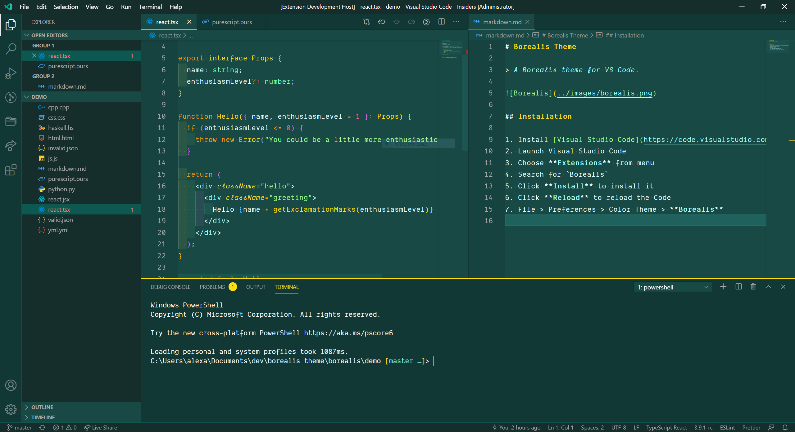

# Borealis Theme

> A Borealis theme for VS Code.

## Installation

1. Install [Visual Studio Code](https://code.visualstudio.com/)
2. Launch Visual Studio Code
3. Choose **Extensions** from menu
4. Search for `Borealis`
5. Click **Install** to install it
6. Click **Reload** to reload the Code
7. File > Preferences > Color Theme > **Borealis**
