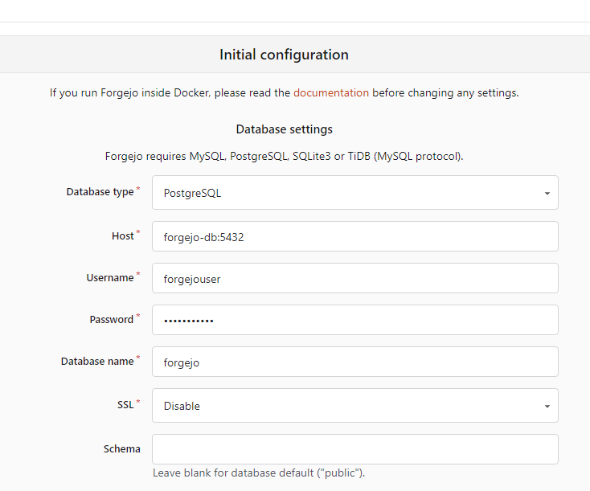

# How to Set Up Forgejo as a Subdomain on Namecheap/Linode using Docker/Nginx

## Introduction

I recently went through the small trouble of setting up
[Forgejo](https://forgejo.org/), a Gitea fork released by the team over at
[Codeberg](https://codeberg.org/) and thought I'd document the process for my
own reference and for anyone who wishes to make the attempt in the near future.
Like all forms of technical documentation, this will likely become out of date
as more versions of Forgejo are released.

For those of you new to the coding scene, but familiar with services like
Github, you will recognize that Github is one of the most user friendly and
ubiquitous version control frontends for Git that there is. That said, as you
become more familiar with the landscape, you will discover other version control
frontends and hosting providers such as [Gitlab](https://about.gitlab.com/),
[Codeberg](https://codeberg.org/), [Sourceforge](https://sourceforge.net/),
[Gitflic](https://gitflic.ru/), and many many others.

You might also find yourself looking into self hosted options. This is where you
take either a home server or a VPS and host your own front end client for git
and git repositories directly. There are several advantages to this including
complete control over your repositories. You essentially can copy the repos and
take them wherever you go. The code hosted on your repos is your own and is not
subject to the whims of a 3rd part like Microsoft with Github. There are of
course some downsides, of course, with the most obvious of which being
visibility and discoverability, as Github is the de facto place on the web to
find new and interesting pieces of software.

All this said, I personally have been delving into the world of self hosting a
bit more recently and self hosting my own Git frontend is something I've wanted
to do since my mentor first introduced me to [Gitea](https://about.gitea.com/).
[Forgejo](https://forgejo.org/) is the spiritual successor to Gitea since they
have recently made efforts to commercialize other ventures based off their main
project, hence why I opted to use Forgejo, despite it being much younger of a
project.

---

### Prerequisites

This document is mainly for myself, but if you happen to have come across this,
and wish to follow along, I'll let you know right of the bat that you'll want to
already have some familiarity with setting up a
[Linode](https://www.linode.com/) or a
[Digital Ocean](https://www.digitalocean.com/) VPS. You of course could set this
up on any VPS that can run Docker and NGINX, but the documentation here will
mainly be using examples from Linode's Client Interface.

Additionally you'll need to have purchased a top level domain from a Domain
Registrar. I have used [Namecheap](https://www.namecheap.com/). Again, you can
use whichever Domain Registrar you prefer, but the way you interface with your
service might vary.

Much of these Prerequisites are covered in a
[previous presentation](https://github.com/tomit4/linode_nginx_docker) I gave on
setting up a basic Website/App using Docker, NameCheap, and Linode. Please
consult this document prior to proceeding with this tutorial, as it will be
assumed you already have familiarity with this setup.

---

### Initial Installation

Firstly, just log into your VPS via SSH. Once there establish a folder where you
will house your docker-compose.yml and the main Forgejo repos. I just dumped
this in my home folder like a slob, but it's probable a cleaner organization
might be in `/usr/local` or `~/.local` or somewhere like that.

Anyways:

```sh
mkdir forgejo && cd forgejo
```

Within this folder use the default `docker-compose.yml` you can find on
[Forgejo's Docker Installation Page](https://forgejo.org/docs/latest/admin/installation/docker/)

```yml
networks:
  forgejo:
    external: false

services:
  server:
    image: codeberg.org/forgejo/forgejo:11
    container_name: forgejo
    environment:
      - USER_UID=1000
      - USER_GID=1000
    restart: always
    networks:
      - forgejo
    volumes:
      - ./forgejo:/data
      - /etc/timezone:/etc/timezone:ro
      - /etc/localtime:/etc/localtime:ro
    ports:
      - "3000:3000"
      - "222:22"
```

You can change the ports if you like. The `USER_UID=1000` and `USER_GID=1000`
stay the same as they are environment variables for your main `$USER` of your
VPS. Just know that this user cannot be Root.

You'll also need to create a `git` user on your host VPS. This user just needs
to be able to log in via SSH to your VPS. so:

```sh
sudo useradd git
```

And in the `/etc/ssh/sshd_config` file append the `git` user to the list of
users allowed to ssh in.

```
AllowUsers git
```

Again, if you have other users that need to login, just append the `git` user to
the end with a space (no new line).

Now we can return to our `forgejo` directory and use `docker-compose` to pull in
our image and spin up our container:

```sh
docker-compose up -d
```

Again, it's looking for the `docker-compose.yml` file, so just be sure you're in
the directory with said file in it.

Now you actually should be able to visit the Forgejo repo using your VPS's ip
address, at the port number you exposed (_i.e._ `3000`), and see the initial
instructions:



Don't worry about adjusting any of the configurations, we're not going to be
using Forgejo for anything but a personal repo where we are the sole user.

Just navigate to the bottom and create an admin user. In the case of this
documentation, this will be the only user of our Forgejo Repos, so just keep
that in mind.

Once done, you should have a basic forgejo installation.

We're going to get to setting up SSL certs and reverse proxying through NGINX in
a bit, but let's first setup the ability to setup pushing code via SSH.

First go to your profile icon in the top right-hand side and go to Settings >
SSH/GPG keys. You can find how to create ssh keys
[here](https://docs.codeberg.org/security/ssh-key/). Once you have copied and
pasted the keys in. You're going to want to be sure your `git` user on your VPS
. Simply invoke:

```sh
cd /home/git && mkdir .ssh && touch authorized_keys
```

In `authorized_keys` paste in your ssh `.pub` hash. _Make sure_ it's the `.pub`
hash. Do **not** paste in your private keys.

Now we should be able to push code to our repos using ssh rather than http.

That said, we would have to use our raw ip address for all of this at this
point. Test all this out first before proceeding. Create a few repos, push using
ssh and http. Make sure everything works.

### Setting Up SSL and Reverse Proxying Through NGINX

This is very similar to the process covered in my
[previous presentation](https://github.com/tomit4/linode_nginx_docker), but
basically we're going to use a subdomain of an existing top level domain I have
in order to setup SSL certs using LetsEncrypt via `certbot`.

First we'll need to navigate to our Linode Networks Dashboard and add the `git`
subdomain.

Once logged into the Linode dashboard, just find your tld domain and append a
A/AAAA record that says:

```
git.mytld.dev
```

Or whatever your TLD name is just prepended with "git."

Once that is done, it might take 24 hours (but more likely will be
instantaneous) for the DNS records to propagate. You can check if their ready
using

```sh
dig git.mytld.dev
```

If the records are there, you'll see the proper output you'd expect from `dig`.

Next is to use `certbot` to generate the SSL certs. Since we're using NGINX as a
reverse proxy, we can just generate them with `cerbot` like so:

```sh
sudo certbot --nginx -d git.mytld.dev
```

You can always append `--dry-run` at the end of the command to see if it will
work first (recommended).

Once the SSL certs are generated and the NGINX configuration is appended.
Navigate to your nginx config. In my case this lives in:

```
/etc/nginx/sites-enabled/default
```

Here you will find the generated NGINX config. You'll need to edit it to reverse
proxy to the docker containing forgejo. Here we can use the recommended
[Forgejo NGINX config](https://forgejo.org/docs/latest/admin/setup/reverse-proxy/#nginx):

```
server {
    listen 80; # Listen on IPv4 port 80
    listen [::]:80; # Listen on IPv6 port 80

    server_name git.example.com; # Change this to the server domain name.

    location / {
        proxy_pass http://127.0.0.1:3000; # Port 3000 is the default Forgejo port

        proxy_set_header Connection $http_connection;
        proxy_set_header Upgrade $http_upgrade;
        proxy_set_header Host $host;
        proxy_set_header X-Real-IP $remote_addr;
        proxy_set_header X-Forwarded-For $proxy_add_x_forwarded_for;
        proxy_set_header X-Forwarded-Proto $scheme;

        client_max_body_size 512M;
    }
}
```

The main point of interest is everything in the `location` block. Certbot should
have generated the rest.

Once this is pasted in you can restart NGINX:

```sh
systemctl restart nginx
```

And now you can visit your `git.mytld.dev` site and it hopefully will work!

---

### Addressing ROOT_URL issue

Once you login though, you'll notice an error that caused me quite some
frustration. Basically you'll likely see an error regarding the fact that
Forgejo was setup using your VPS's IP address and that it makes no guarantees
about the quality due to the mismatch of what it perceives as a different TLD
being used. We need to change this.

Now, Forgejo's docs talk about an `app.ini` and anyone who has used Gitea in the
past will be familiar with this, but i t took me many hours to realize the
`app.ini` was not where the documentation as of version LTS(v11.0.3) is
incorrect about where this file lives. It took me embarrassingly long to realize
the generated `app.ini` file resides in the `gitea` directory, and not at the
directory where the docs say it is. So from the `forgejo` directory on your host
machine VPS:

```sh
cd data/gitea/conf
```

And here you will find the `app.ini`. You'll need to change a few things, change
the following fields using your editor of choice:

```sh
[server]
DOMAIN = git.mytld.dev
SSH_DOMAIN = git.mytld.dev:222
ROOT_URL = https://git.mytld.dev
```

Just restart the docker container:

```sh
docker container restart forgejo
```

And This will rid you of the annoying warning message on login and also make
sure the proper ssh address is provided when opting to create a repository
through which you will mainly be pushing changes via ssh.

---

### Conclusion

And that's it! My apologies if this document feels a bit off the cuff, but as I
mentioned at the beginning this document is mainly for my own future reference.
If you have any desire to reach out to me though regarding this or any other
tech related topic, please feel free to do so via my
[email](brianhayes.dev@protonmail.com).
